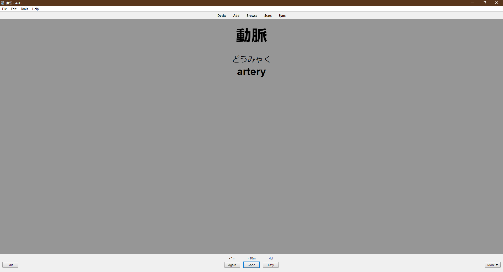

# Midori Anki

## About

This script converts from [Midori](https://apps.apple.com/us/app/midori-japanese-dictionary/id385231773) exported CSV files into [Anki](https://apps.ankiweb.net/) decks. You can also use any other CSV files that follows the  `kanji,kana,meaning` convention.

## Screenshot



## Installation

```bash
    python -m venv venv/
    python -m pip install --user -r requirements.txt
```

## Usage

```powershell
    # show help message
    python convert.py --help
```

Deck name and title default to `--file` stem if `--name` is not explicitly specified in the command prompt; the default target directory is the current working directory.

```powershell
    # create new deck, path to csv file resolves relative to cwd
    python midorianki.py --file 'path/to/file.csv'
```

```powershell
    # specify target directory
    $DesktopPath = [Environment]::GetFolderPath("Desktop")
    python midorianki.py --file 'path/to/file.csv' --name 'Deck Title' --dest $DesktopPath
```
